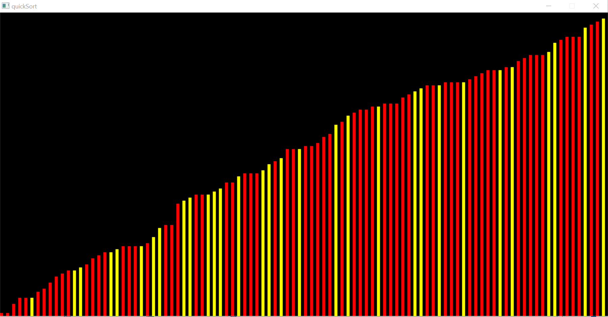

# SDL_sort-quicksort

## Presentation

this is a vizualisation of quicksort algorithm.<br/>
initially bars of random lenghts are displayed then step by step they are moved by the algorithm the their correct position <br/>
yellow bars are pivot points
cmake file included for clion users
(to use the .exe file one must include the missing DLLs)


here is an unsorted initial list


and here is a sorted final list



## Setup

```bash 
# install sdl2 library
yay -S sdl2 # for arch linux
apt-get install libsdl2-dev # for ubuntu/debian

# compile files
make

#run the project 
./quicksort

```
