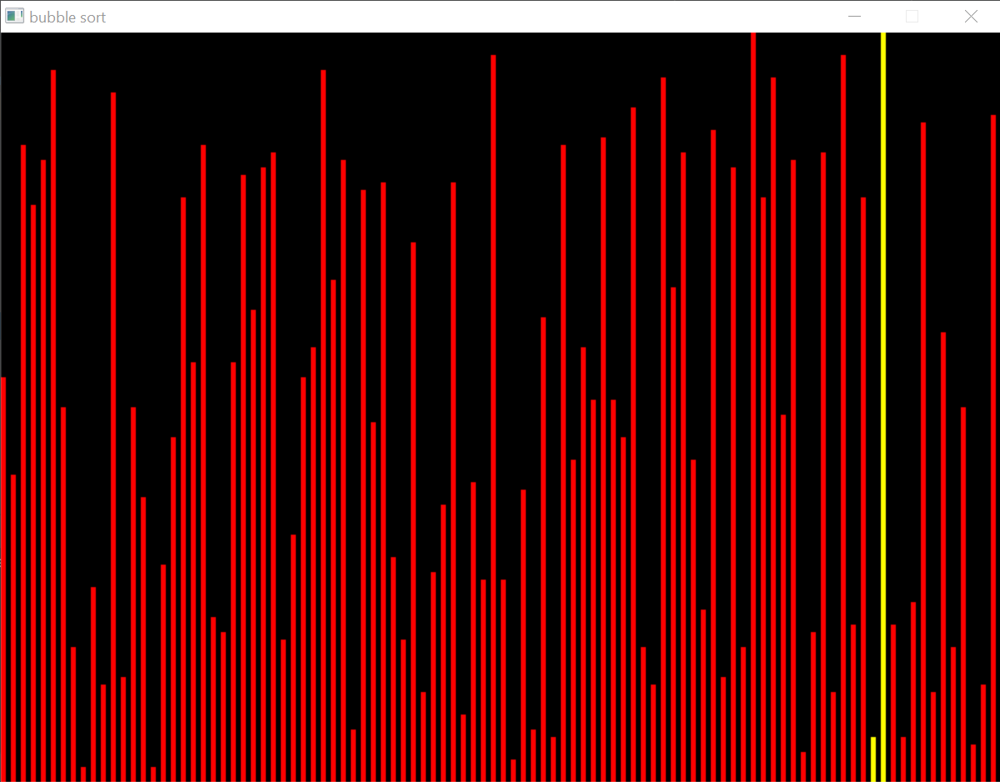
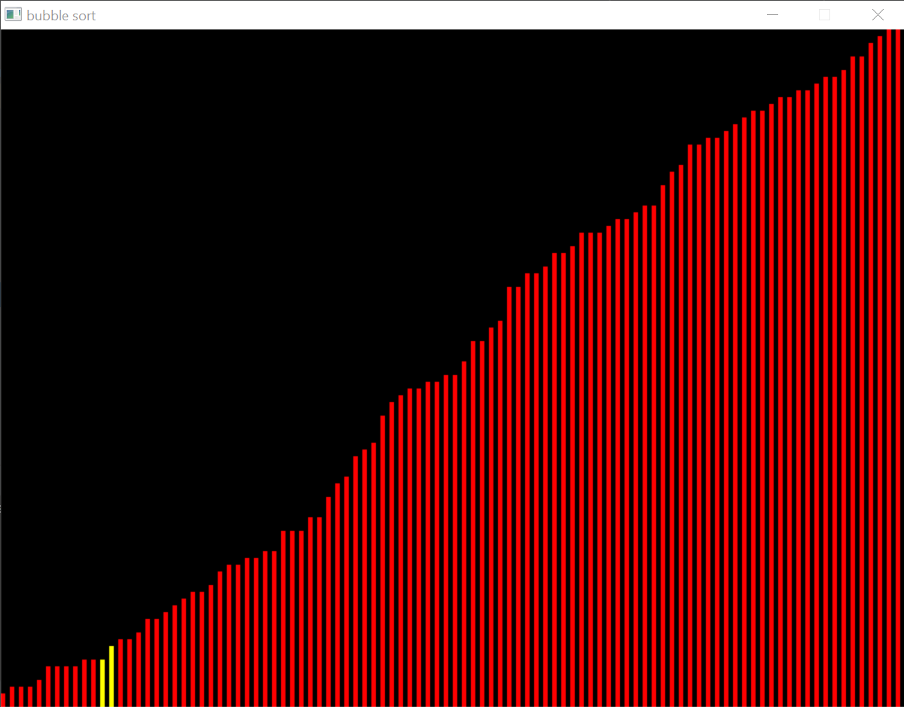

# sdl_bubble_sort

this is a visualization of bubble sort algorithm. 
initially bars of random lenghts are displayed then step by step they are swapped by the algorithm the their correct position  
cmake file included for clion users

yellow lines show the current swap

here is an unsorted initial list

and here is a sorted final list

